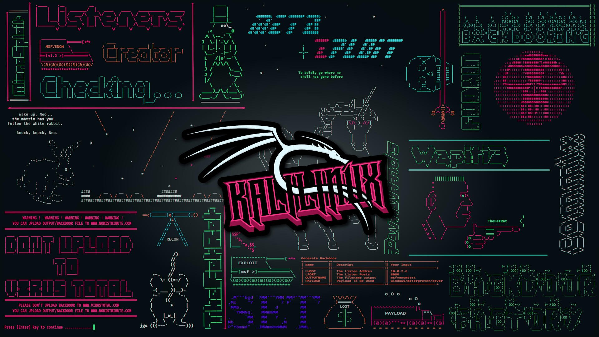

  

<h1 align="center">Samuel Araújo Cocchi Amaral</h1>

  <strong>Blue Team · SOC Analyst Jr. · Segurança Cibernética</strong> 
  Monitoramento &nbsp;|&nbsp; Detecção &amp; Correlação &nbsp;|&nbsp; Análise de Logs &nbsp;|&nbsp; Resposta a Incidentes

  
  &nbsp;
  
  &nbsp;
  

---

## Sobre mim

Estudante de **Tecnologia em Segurança Cibernética** (Faculdade Impacta) com foco em **Blue Team e SOC**. Desenvolvo laboratórios práticos em ambientes virtualizados, cobrindo detecção de ameaças, análise de logs, hardening e resposta a incidentes. Minha base em conformidade operacional, rastreabilidade de dados e auditoria — construída no ambiente corporativo — complementa diretamente as competências de governança e monitoramento exigidas em operações de segurança.

**Objetivo:** Analista de SOC Júnior / Analista de Segurança da Informação Júnior / Estágio em Cibersegurança

---

## Stack técnica

  
  
  
  
  
  
  
  
  

| Categoria | Ferramentas |
|-----------|-------------|
| SIEM / NIDS | Wazuh · Suricata |
| Análise de tráfego | Wireshark |
| Pentest / Lab ofensivo | Nmap · Metasploit · Kali Linux |
| Monitoramento Windows | Windows Event Viewer |
| Redes | Cisco Packet Tracer · VLANs · ACLs · Port Security |
| Virtualização | VMware · VirtualBox · Hyper-V |
| Frameworks | MITRE ATT&CK · ISO 27001 · LGPD |

---

## Laboratórios de Detecção & Resposta

> Todos os projetos seguem o ciclo: **simulação de ataque → detecção → análise → mitigação → validação**

### Engenharia de Detecção — Wazuh + Suricata (Zero Trust)
Implantação de pipeline de detecção integrando **Wazuh (SIEM/XDR)** e **Suricata (NIDS)** em arquitetura Zero Trust. Criação de regras de correlação customizadas com mapeamento de TTPs ao **MITRE ATT&CK**; validação de alertas via ingestão de logs de rede e eventos de endpoint.

### Resposta a Incidentes — Brute Force em RDP (Event ID 4625)
Simulação de ataque de força bruta contra **RDP** em ambiente Windows. Triagem no **Windows Event Viewer** (Event ID 4625), identificação de padrões de ataque e aplicação de contramedidas: bloqueio de IP, política de lockout de conta e hardening do serviço.

### Hardening L2 — MAC Flooding + Port Security
Execução controlada de **MAC Flooding**, análise do impacto na tabela CAM e implementação de **Port Security** com limitação de endereços MAC por porta e modo de violação (shutdown). Validação de eficácia pós-hardening.

### Exploração e Mitigação — MS17-010 (EternalBlue)
Ciclo completo: reconhecimento com **Nmap**, exploração via **EternalBlue/Metasploit**, análise de tráfego pré/pós com **Wireshark**. Fase defensiva: patch MS17-010, desabilitação do SMBv1 e validação via nova tentativa de exploração.

### Consultoria em Segurança da Informação — Projeto Acadêmico (2º lugar)
Avaliação completa de segurança em instituição de ensino público: inventário de ativos, matriz de riscos **ISO 27001**, adequação à **LGPD**, desenvolvimento de SGSI, Política de Segurança da Informação e Threat Modeling.

---

## Certificações

| Status | Certificação |
|--------|-------------|
| ✅ Concluído | CCNA: Introdução a Redes |
| ✅ Concluído | CCNA: Switching, Roteamento e Wireless |
| ✅ Concluído | NDG Linux Unhatched |
| ✅ Concluído | Python Essentials 1 · IT Essentials 7.0 |
| 🔄 Em andamento | CyberOps Associate (Cisco) |
| 🔄 Em andamento | CCST Cybersecurity · Network Security (Cisco) |
| 🔄 Em andamento | AWS Academy Cloud Foundations |

---

## Formação

- **Tecnólogo em Segurança Cibernética** — Faculdade Impacta *(2025 – 2027)*
- **Técnico em Informática** — Senac Santana
- **Técnico em Eletrônica** — ETEC Albert Einstein